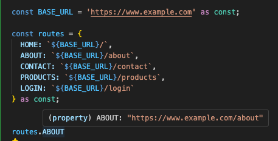

# TypeScript Snippets

## General TypeScript

### Basics

```ts
const numbers: number[] = [1, 2, 3, 4, 5];

const sum: number = numbers.reduce<number>((acc, curr) => {
  return acc + curr;
}, 0);

console.log(sum); // Output: 15
```

In this example, the type parameter for the `reduce` method is specified as `number`, which indicates that the reduce method should expect an array of numbers.

[[↑] Back to top](#top)

### as const

- In TypeScript, `as const` is a type assertion that tells the compiler to infer a "literal" type for an expression.
- When applied to an object or an array, as const makes all the properties or elements read-only and immutable, so that they cannot be changed or reassigned. This can be useful for ensuring that certain values remain constant throughout the program.

```js
// Object Example
const person = {
  name: 'Alice',
  age: 30,
  address: {
    city: 'London',
    country: 'UK',
  },
} as const;

person.name = 'Bob'; // Error: Cannot assign to 'name' because it is a read-only property.
person.address.city = 'Paris'; // Error: Cannot assign to 'city' because it is a read-only property.

// Array Example
const fruits = ['apple', 'banana', 'orange'] as const;

fruits[0] = 'pear'; // Error: Index signature in type 'readonly ["apple", "banana", "orange"]' only permits reading.
```

- with both the `person` object and the `fruits` array, we can ensure that neither of them can be changed or reassigned
  at runtime
- this also means that we can't add additional properties to the object nor can we add or remove items from the fruits array

[[↑] Back to top](#top)

#### Routes `as const` Example

**CM: I love this, super useful for routes**

```ts
const BASE_URL = "https://www.example.com" as const;

const routes = {
  HOME: `${BASE_URL}/`,
  ABOUT: `${BASE_URL}/about`,
  CONTACT: `${BASE_URL}/contact`,
  PRODUCTS: `${BASE_URL}/products`,
  LOGIN: `${BASE_URL}/login`,
} as const;

routes.ABOUT;
```

And now if you look at what happens in VS Code, I can hover over `routes.ABOUT` and see the full
route:



[[↑] Back to top](#top)

#### Interface `as const` Example

- Here's another example:

```ts
const UserType = {
  Admin: "admin_user",
  Basic: "basic_user",
} as const;

interface UserTypeResponse {
  level: (typeof UserType)[keyof typeof UserType];
  name: string;
  position: string;
}
```

- The above code defines an object `UserType` with two properties, `Admin` and `Basic`, which both have string values.
- The `as const` assertion ensures that the properties of `UserType` are readonly and cannot be modified.
- The interface `UserTypeResponse` is also defined and, in this example, is what we'd receive back
  from a server, for example. The interface has three properties:
  - `level`: This property is defined as a union type that maps the keys of `UserType` to their corresponding values. This means that `level` can only have the values `'admin_user'` or `'basic_user'` (and NOT `'admin'` or `'basic'`')
  - `name`: A string property that holds the name of the user.
  - `position`: A string property that holds the position of the user.
- The `UserTypeResponse` interface is then used as the type for the `user` variable, which is assigned an object that matches the interface.
- The `user` variable is then logged to the console, which outputs the following:

```ts
{
  level: 'admin_user',
  name: 'John Doe',
  position: 'Software Engineer'
}
```

[[↑] Back to top](#top)

### Dynamically Creating Types

- I had a situation where I needed to create a large object that had two levels: a broader level that (for
  this example) was the league type (e.g. `NFL` or `NBA`) and then the team city (e.g. `PHILADELPHIA` or `NEW YORK`).
- So the object would look something like this with simple JavaScript:

```ts
const NFL = "NFL";
const NBA = "NBA";

const PHILADELPHIA = "PHILADELPHIA";
const NEW_YORK = "NEW_YORK";

const teamObject = {
  [NFL]: {
    [`NFL-${PHILADELPHIA}`]: {
      teams: ["Eagles"],
    },
    [`NBA-${NEW_YORK}`]: {
      teams: ["Giants", "Jets"],
    },
  },
  [NBA]: {
    [`NBA-${PHILADELPHIA}`]: {
      teams: ["Sixers"],
    },
    [`NBA-${NEW_YORK}`]: {
      teams: ["Knicks", "Nets"],
    },
  },
};
```

```ts
export type TeamObject = {
  teams: string[];
};
export type TEAM_REGIONS = "PHILADELPHIA" | "NEW_YORK";

type LeagueCodesNFL = `NFL-${TEAM_REGIONS}`;
type LeagueCodesNBA = `NBA-${TEAM_REGIONS}`;

export type LeagueCodes = LeagueCodesNFL | LeagueCodesNBA;

export type Leagues = {
  NFL: Map<LeagueCodesNFL, TeamObject[]>;
  NBA: Map<LeagueCodesNBA, TeamObject[]>;
};

export type LeaguesMap = Map<Leagues, TeamObject[]>;
```

#### Typing a Reducer

- Here is an example for a reducer (React's `useReducer`) where I wanted two main types,
`TOGGLE_CELL` and `TOGGLE_CONSTRAINT`, but every time I did `{ type: TOGGLE_CELL; ...}` it
would give me an error. I created separate types for each and then could build it out

```ts
export const TOGGLE_CELL = 'TOGGLE_CELL';
export const TOGGLE_CONSTRAINT = 'TOGGLE_CONSTRAINT';

// Use `typeof` to create types from the constants
type ToggleCellActionType = typeof TOGGLE_CELL;
type ToggleConstraintActionType = typeof TOGGLE_CONSTRAINT;

export type Action =
  | { type: ToggleCellActionType; rowIndex: number; cellIndex: number }
  | {
      type: ToggleConstraintActionType;
      rowIndex: number;
      cellIndex: number;
      direction: Direction;
    };
```

### Pick

I don't use `Pick` a lot but here is a simple example and a cool way to create a new type without
having to type out all the properties:

```ts
type ProductCardProps = {
  name: string;
  price: number;
  imageUrl: string | undefined | null;
  isOnSale: boolean;
  salePercentage: number | undefined | null;
  category: string;
  description: ReactNode;
  inventoryCount: number;
};

type ProductPriceTagProps = Pick<
  ProductCardProps,
  "price" | "isOnSale" | "salePercentage"
>;
```

So now `ProductPriceTagProps` is a new type that only has the `price`, `isOnSale`, and `salePercentage`.

[[↑] Back to top](#top)

## React TypeScript

- Here is a basic functional component with TypeScript props

```tsx
import React from "react";

interface Props {
  name: string;
  age: number;
}

const MyComponent = ({ name, age }: Props) => {
  return (
    <div>
      <p>Name: {name}</p>
      <p>Age: {age}</p>
    </div>
  );
};

export default MyComponent;
```

- Here is the same component but using the `FunctionComponent` type

```tsx
import React, { FunctionComponent } from "react";

interface Props {
  name: string;
  age: number;
}

const MyComponent: FunctionComponent<Props> = ({ name, age }) => {
  return (
    <div>
      <p>Name: {name}</p>
      <p>Age: {age}</p>
    </div>
  );
};

export default MyComponent;
```

- Just looking around, I'm not sure there are real benefits to using the `FunctionComponent` type. See this [article](https://github.com/facebook/create-react-app/pull/8177#issue-537764080).

[[↑] Back to top](#top)

## Zustand-TypeScript Snippets

```ts
import { create } from "zustand";
import { persist } from "zustand/middleware";
import { PREFIX } from "@/constants/stores";

export type MetaDataState = {
  useLoggedIn: boolean;
};

type MetaDataActions = {
  getKey: (key: string) => unknown;
  setKey: (key: string, value: unknown) => void;
};

export const useMetaDataStore = create<MetaDataState & MetaDataActions>()(
  persist(
    (set, get) => ({
      useLoggedIn: false,

      getKey: (key: string) => get()[key as keyof MetaDataState],
      setKey: (key: string, value: unknown) => set({ [key]: value }),
    }),
    {
      name: `${PREFIX}__METADATA__`,
    }
  )
);

export const getMetaDataKey = (key: string) =>
  useMetaDataStore.getState().getKey(key);

export const setMetaDataKey = (key: string, value: unknown) =>
  useMetaDataStore.getState().setKey(key, value);
```

- I like the combination of the two types - I think it's a cool way to separate the state
  from the actions.
- `getKey: (key: string) => get()[key as keyof MetaDataState],` this code was tricky because
  it was yelling at me so I had to add the `as keyof MetaDataState` to get it to work. Here's the original
  error:

  > Element implicitly has an 'any' type because expression of type 'string' can't be used to index type 'MetaDataState & MetaDataActions'. No index signature with a parameter of type 'string' was found on type 'MetaDataState & MetaDataActions'

- This is also a really good basic implementation of Zustand with `create` and `persist` middleware.

[[↑] Back to top](#top)
