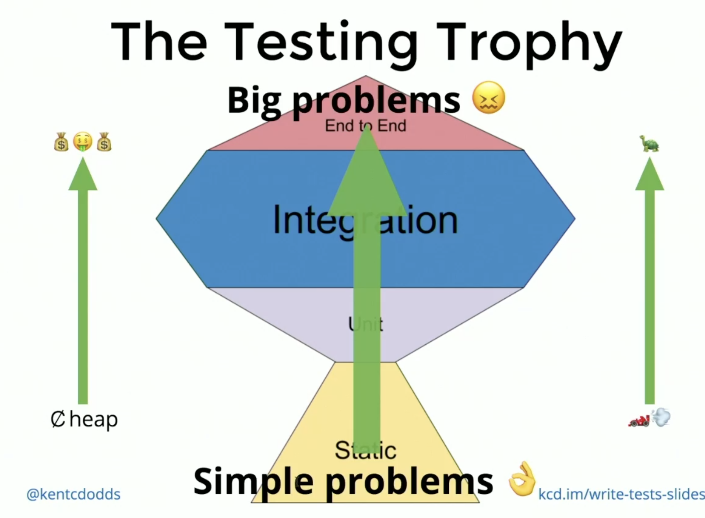

# Front End Masters: Testing Practices and Principles

- [Course Link](https://frontendmasters.com/courses/testing-practices-principles/course-code-walkthrough/)
- [Course Materials](https://github.com/FrontendMasters/testing-workshop)

## Overall

- Overall, it was a good course but I have seen a bunch of this from working already. It was a good overview.
- This testing trophy is interesting:



- the higher you go, the more expensive it is to run the test and the slower they run.


## Section 1: Unit Tests

- one cool snippet is for unit tests when trying to test multiple cases. In this example, 
we are checking whether `isPasswordAllowed` is returning the correct value for multiple
good and bad passwords:

```js
describe('isPasswordAllowed only allows some passwords', () => {
  const badPasswords = [123, 'fffffff', '1234567']
  const goodPasswords = ['123.abc', '123abc.', 'abc123.']

  badPasswords.forEach(badPassword => {
    test(`isPasswordAllowed rejects ${badPassword}`, () => {
      expect(isPasswordAllowed(badPassword)).toBe(false)
    })
  })

  goodPasswords.forEach(goodPassword => {
    test(`isPasswordAllowed accepts ${goodPassword}`, () => {
      expect(isPasswordAllowed(goodPassword)).toBe(true)
    })
  })
})
```

- Dodds recommends not necessarily getting 100% code coverage. At a certain point, you're changing
source code to fit your tests.
- Code coverage also doesn't consider how necessary a particular part of the code is...not all code
is of equal importance.

## Section 2: Mocks

- CM: the first part of the mocks section I've done before. I get how he "monkey patches" the function
but I never did that or learned that...I started at how it looks like it should be done.
- you could also create a `__mocks__` directory and put the mock in there. Then you can just import it
like any other module.

## Section 3: Testing Practices